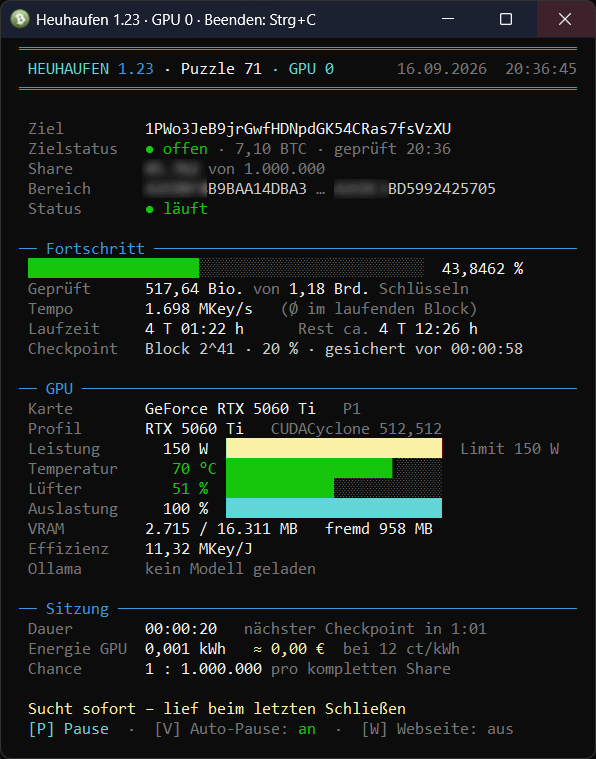
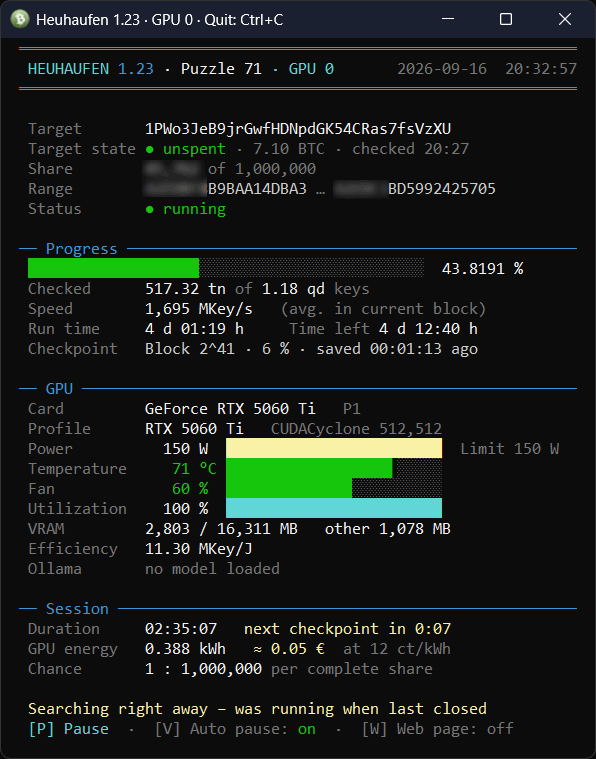
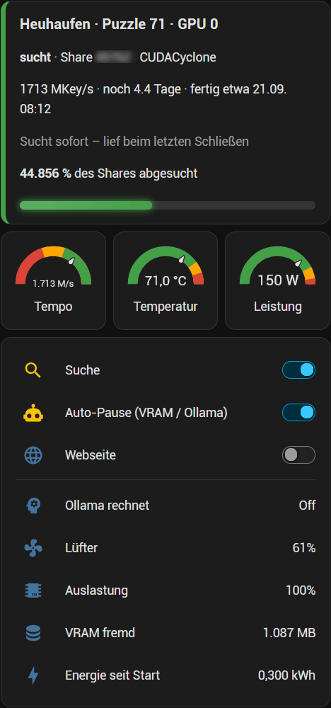
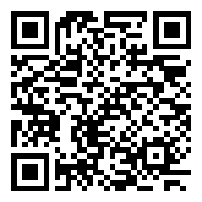
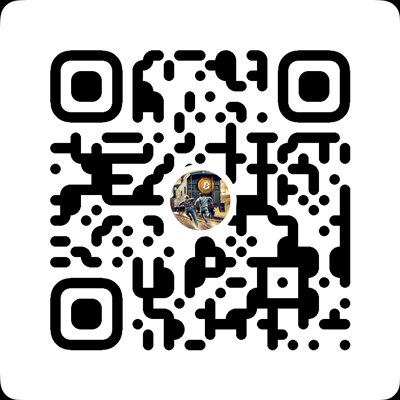

# Heuhaufen 1.23

| Dashboard (Deutsch) | Dashboard (English) | Home Assistant Card |
| --- | --- | --- |
|  |  |  |

Windows dashboard for searching the **Bitcoin puzzle** keys on NVIDIA GPUs, with
[BitCrack](https://github.com/brichard19/BitCrack) or [CUDACyclone](https://github.com/Dookoo2/CUDACyclone).
PowerShell only - no installation, no service, nothing is sent anywhere.

> **Scope:** the search only runs inside the ranges of the public puzzle transaction from 2015.
> It is not a tool for other people's wallets, and it is not meant to be one.
> The chance of finding puzzle 71 is tiny; this is a hobby project.

## What you get

- **Live dashboard** in the console: progress, speed, temperature, power, cost, checkpoint countdown.
- **Sections (shares)**: a random share per card, finished ones are recorded and never drawn again.
  Several computers can share the list.
- **Resume**: BitCrack saves every minute, CUDACyclone every one to two minutes - a restart continues where it stopped.
- **Automatic pause** when another program needs the card (game, video editing, AI), optional direct
  Ollama query; the search continues by itself.
- **Web page** in your own network (all cards, buttons for pause/resume), no password - keep it off the internet.
- **Home Assistant** via MQTT discovery: sensors, switches and two ready-made dashboard cards.
- **Multiple GPUs**: one window per card, each on its own share.
- **Tuning**: measures grid/block settings and the best power limit per card model, also for several identical cards together.
- **German and English**, chosen by the Windows display language or by `$Sprache`.
- **Hit handling**: an offline check script and a checklist for what to do (and what never to do) with a found key.

## Requirements

- Windows 10 or 11, Windows PowerShell 5.1 (included in Windows).
- NVIDIA graphics card with a current driver. CUDA does **not** need to be installed.
- For CUDACyclone: GTX 16xx / RTX 20xx or newer. Older cards use BitCrack.

## Quick start

1. Download the ZIP from [Releases](../../releases) (or clone the repository).
2. Unblock the files once - Windows marks downloads as "from the internet":
   `Get-ChildItem -Recurse | Unblock-File`
3. Copy `puzzle-config.beispiel.ps1` to `puzzle-config.ps1` and look through it.
4. Optional but recommended: run `tuning.bat` once (measures the best settings for your card).
5. Start `puzzle.bat`. It asks for administrator rights, which are only used to set the power limit
   and to end the search program cleanly.

Without `puzzle-config.ps1` the built-in defaults apply: puzzle 71, CUDACyclone if present, no power limit change,
no web page, no MQTT. The example config switches the web page on and explains every setting.

The full manual is in **[README.txt](README.txt)** (English) and **[LIESMICH.txt](LIESMICH.txt)** (German):
keys, configuration, web page, Home Assistant, tuning, automatic pause, autostart.

## The faster search program (CUDACyclone)

CUDACyclone is roughly 70 % faster than BitCrack on modern cards, but the original project has **no license**,
so no binary is shipped here. Building it yourself takes a few minutes and no local toolchain:

1. Fork [SittingDuck52/CUDACyclone](https://github.com/SittingDuck52/CUDACyclone) (branch `resume`) into your account.
2. Open the **Actions** tab of your fork and enable workflows.
3. Run the workflow **Build Windows** (`build.yml`) and download the artifact when it is done.
4. Put `CUDACyclone.exe` into `programm\` next to `cuBitCrack.exe`.

That branch contains two changes over the original: a fix for keys that could be skipped after a prefix match,
and the ability to resume; both are offered upstream as pull requests. Without the file, the search simply
uses BitCrack and says so.

## Home Assistant

Set `$MqttHost` in the configuration and Home Assistant creates the device by itself (MQTT discovery):
state, speed, progress, time left, power, temperature, fan, energy, hit (yes/no only, never the key) and
switches for search, automatic pause and web page. Ready-made cards are in [homeassistant/](homeassistant).

## If a key is really found

The window shows a green box and beeps, the key is written to `daten\found*.txt`.
**Do not** broadcast the transaction with a normal wallet: the public key becomes visible and a 71-bit key
can be computed from it in minutes, which is how earlier puzzle prizes were stolen by bots.
Read **[HIT-Emergency-Plan.md](HIT-Emergency-Plan.md)** (German: [TREFFER-Notfallplan.md](TREFFER-Notfallplan.md)) first.
`skripte\pruefe.ps1` verifies a find completely offline.

## Virus scanners and SmartScreen

Key search programs are regularly flagged by scanners, and the binaries here are not code-signed, so Windows
SmartScreen will warn on first start. The sources of both search programs are public (links above); anyone
who prefers can build them and check them.

## Support

Hobby project, spare-time answers. Issues are welcome; please include Windows version, graphics card,
driver version and what the window showed.

## Donation

If this was useful to you, or if it really found something:

On-chain: `bc1q63tve4ch6lfffavfr20nqf2vct4taac3r68enm`

QR code for the Bitcoin address

Lightning (small tips): `heuhaufen@strike.me`

QR code for the Lightning address

Addresses are only valid as shown in this repository; never trust one posted in an issue or a fork.

## License

MIT for the scripts in this repository, see [LICENSE](LICENSE).
Third-party components (BitCrack, CUDA runtime, CUDACyclone): [THIRD-PARTY.md](THIRD-PARTY.md).

---

**Deutsch:** Windows-Dashboard fuer die Suche nach den Schluesseln der Bitcoin-Puzzle-Adressen auf NVIDIA-Karten.
Anleitung in [LIESMICH.txt](LIESMICH.txt), Notfallplan bei einem Treffer in [TREFFER-Notfallplan.md](TREFFER-Notfallplan.md).
Gesucht wird ausschliesslich in den Bereichen der oeffentlichen Puzzle-Transaktion von 2015, nie nach fremden Wallets.